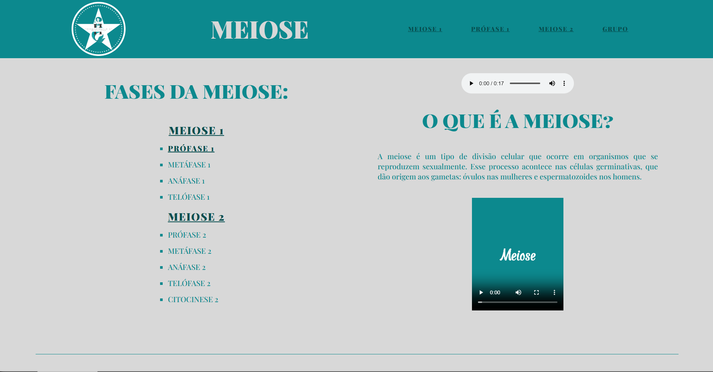

# Website de Biologia - Processo de Meiose

---

## 📌 Descrição

Este projeto é um **website estático** feito para a disciplina de Biologia, com o objetivo de explicar o processo de **meiose**. O site apresenta informações sobre as fases da meiose e inclui imagens ilustrativas, áudios e descrições para facilitar o entendimento do conteúdo. Ele foi desenvolvido como parte de um trabalho acadêmico integrado entre as disciplinas de **Biologia** e o curso de **Análise e Desenvolvimento de Sistemas**.

---

## 🚀 Tecnologias

**HTML • CSS • Google Fonts**

---

## 🎯 Objetivo

O projeto foi desenvolvido para **praticar, reforçar e aprimorar habilidades em desenvolvimento web**, além de aprofundar o conhecimento sobre o processo de meiose e aprimorar a **colaboração em grupo**.

---

## 📸 Demonstração

---

## 🌐 Acesse o Projeto

  

---

## 👨‍💻 Desenvolvedores

• Agatha Aline França  
• Ana Beatriz Farias Pereira  
• Juan Matheus de Oliveira Lopes  
• Lucas Aguiar Pereira Marin  
• Zayra Alice França

